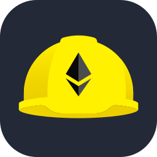
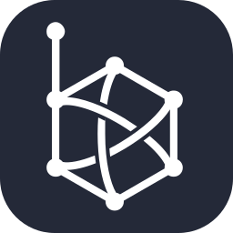
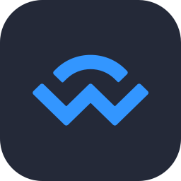

  

---

### Welcome to the **Ethereum Developer Program** offered by **Kerala Blockchain Academy**..!!

 

  
  

 
Learn Ethereum development from the ground up! This course covers Ethereum’s core architecture, smart contract design, and Web3 tools. You'll gain hands-on experience with Solidity, enabling you to build secure DApps.  
  
Join our KBA community for support as you explore open-source projects, hackathons, and Ethereum Improvement Proposals (EIPs). This course aligns with the Ethereum Foundation’s vision, preparing you to contribute to the Web3 ecosystem with KBA’s ongoing support. 🚀

# 📌 Course Outcomes

| ✅ Ethereum Basics Mastery         | 🔗 Decentralization-First Mindset |
| ---------------------------------- | --------------------------------- |
| 💻 Solidity Coding Skills          | 🛠️ Web3 Tools Expertise           |
| 🏗️ DApp Architecture Understanding | 🌍 Ethereum Ecosystem Know-How    |

# 🧩 Languages, Tools & Frameworks

